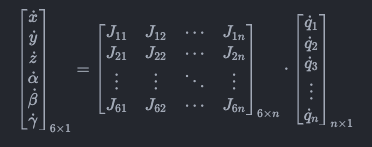
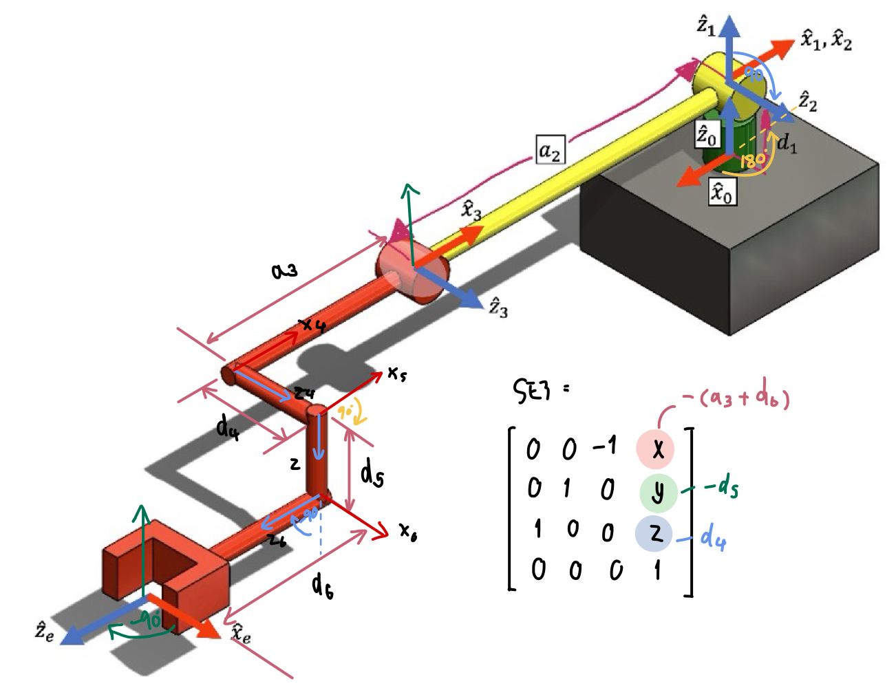

# FRA333_HW3_6559
 This homework aims to apply **differential kinematics** concepts to a 3-DOF robotic manipulator. The goal is to calculate the **Jacobian matrix**, analyze **singularity** conditions, and compute **effort** required for specific configurations.

 ## Table of Contents
1. [Installation](#installation)
2. [Function](#function)
    - [Jacobian Matrix Function](#1-jacobian-matrix-function)
    - [Checking Singularity](#2-check-singularity-function)
    - [Effort Calculation](#3-compute-effort-function)
3. [Check Function](#check-function)
    - [Check Jacobian](#1-use-function-for-check-jacobian-matrix)
    - [Check Sigularity](#2-use-function-check-singularity)
    - [Check Effort](#3-use-function-check-compute-effort)

## Installation

### Setup Environment

To get started with the project, you'll need to set up your environment with the necessary dependencies.

#### Prerequisites

- **Python 3.9.x or newer**
- **`numpy`**: For numerical operations.
- **`Robotics Toolbox for Python`**: To work with robot models and calculate kinematics.
- **`math`**: For mathematical calculations.
- **`spatialmath`**: For spatial transformations.
- **`matplotlib`**: For plotting graphs.

#### Step

1. **Clone the repository**

   Download the project to your local machine using Git:
   ```bash
   git clone https://github.com/ImJAiiiii/FRA333_HW3_6559.git
   cd robot-jacobian
   ```

2. **Create a Python virtual environment**

    To keep dependencies isolated, create and activate a virtual environment
    ```bash
    python3 -m venv env
    source env/bin/activate  # On Windows, use `env\Scripts\activate`
    ```

3. **Install the required libraries**

    Once your virtual environment is active, install all required dependencies:
    ```bash
    pip install numpy roboticstoolbox-python spatialmath-python matplotlib
    ```

## Function

### 1. Jacobian Matrix Function

**Jacobian** is Matrix in robotics which provides the relation between joint velocities $\dot{X}$  & end-effector velocities $\dot{q}$ of a robot manipulator.

$$\dot{X} = J(q) \cdot \dot{q}$$

Where:

* $\dot{X}$ is represents the velocity of the end-effector.

* $J_q$ is the Jacobian matrix that maps joint velocities $\dot{q}$ to end-effector velocities.

Expanded form of the Jacobian:

<p align="center">
  
</p>

In this context:

- The **first three rows** represent the **Linear Velocity Jacobian (Jv)**, which describes how the joint velocities affect the linear velocity of the end-effector.

- The **last three rows** represent the **Angular Velocity Jacobian (Jw)**, which describes how the joint velocities affect the angular velocity of the end-effector.

$$
J = \begin{bmatrix}
    J_v \\
    J_\omega
\end{bmatrix}_{6 \times n}
$$

Where:

* $J_v$ is the part of the Jacobian that relates joint velocities to linear velocities.

* $J_ ω$ is the part of the Jacobian that relates joint velocities to angular velocities.

#### Finding $J_v$ of 3R Robot

The **Translational Jacobian (Jv)** describes how the velocities of the joints affect the linear velocity of the robot’s end-effector. To compute \(Jv\) for a 3R robot:

1. **Revolute Joint Contribution**:
   For each revolute joint $i$, the contribution to the end-effector's linear velocity is calculated using the cross product of the joint's rotation axis $z_i$ and the vector from the joint to the end-effector position:

$$ J_v = z_i \times (p_e - p_i) $$

Where:
   - $z_i$ is the axis of rotation for the $i$-th joint (often represented as the z-axis of the joint's frame).
   - $p_e$ is the position vector of the end-effector.
   - $p_i$ is the position vector of the $i$-th joint.

2. **Jv for Multiple Joints**:
    For a 3R robot, we will compute $Jv_1$, $Jv_2$, and $Jv_3$, corresponding to the contributions of the first, second, and third joints, respectively, to the linear velocity of the end-effector.

3. **Matrix Form**:
   The **Translational Jacobian** for the 3R robot is formed by stacking the contributions $Jv_1$, $Jv_2$, and $Jv_3$ together:

$$
J_v = \begin{bmatrix}
    z_1 \times (p_e - p_1) & z_2 \times (p_e - p_2) & z_3 \times (p_e - p_3)
\end{bmatrix}
$$
   
#### Finding $J_\omega$ of 3R Robot

The **Angular Velocity Jacobian (Jw)** describes the relationship between the joint angular velocities and the angular velocity of the robot’s end-effector.

$$J_\omega = \begin{bmatrix}z_1 & z_2 & z_3\end{bmatrix}$$

$J_e$

**Finding $z_i$ and $p_i$**

from `HW3_utils.py` function `FKHW3(q)` it return `R`, `P`, `R_e` and `P_e`

example: $q$ = [0, 0, 0]

`R` is 3x3x4 represent the rotation matrix of different joint

$$
R = 
        \begin{bmatrix}
            -1.0000000e+00 & -1.0000000e+00 & -1.0000000e+00 & 6.1232343e-17\\
            -1.2246469e-16 & -7.4987988e-33 & -7.4987988e-33 & 6.1232343e-17\\
            0.0000000e+00 & 1.2246469e-16 & 1.2246469e-16 & 1.0000000e+00\\
        \end{bmatrix}
$$

$$
        \begin{bmatrix}
            1.2246469e-16 & 1.2246469e-16 & 1.2246469e-16 & 1.0000000e+00\\
            -1.0000000e+00 & -6.1232343e-17 & -6.1232343e-17 & -1.2246469e-16\\
            0.0000000e+00 & 1.0000000e+00 & 1.0000000e+00 & -6.1232343e-17\\
        \end{bmatrix}
$$

$$
        \begin{bmatrix}
            0.0000000e+00 & 0.0000000e+00 & 0.0000000e+00 & 1.2246469e-16\\
            0.0000000e+00 & 1.0000000e+00 & 1.0000000e+00 & 1.0000000e+00\\
            1.0000000e+00 & 6.1232343e-17 & 6.1232343e-17 & -6.1232343e-17\\
        \end{bmatrix}
$$

* for $R_1$:

    $$
    R_1 =   \begin{bmatrix}
                -1.0000000e+00 & -1.0000000e+00 & -1.0000000e+00\\
                -1.2246469e-16 & -7.4987988e-33 & -7.4987988e-33\\
                0.0000000e+00  & 1.2246469e-16  & 1.2246469e-16\\
            \end{bmatrix}
    $$

* for $R_2$:

    $$
    R_2 =   \begin{bmatrix}
                1.2246469e-16 & 1.2246469e-16 & 1.2246469e-16\\
                -1.0000000e+00 & -6.1232343e-17 & -6.1232343e-17\\
                0.0000000e+00  & 1.0000000e+00  & 1.0000000e+00\\
            \end{bmatrix}
    $$

* for $R_3$:

    $$
    R_3 =   \begin{bmatrix}
                0.0000000e+00 & 0.0000000e+00 & 0.0000000e+00\\
                0.0000000e+00 & 1.0000000e+00 & 1.0000000e+00\\
                1.0000000e+00  & 6.1232343e-17  & 6.1232343e-17\\
            \end{bmatrix}
    $$

* for $R_e$:

    $$
    R_e =   \begin{bmatrix}
                6.1232343e-17 & 6.1232343e-17 & 1.0000000e+00\\
                1.0000000e+00 & -1.2246469e-16 & -6.1232343e-17\\
                1.2246469e-16  & 1.0000000e+00  & -6.1232343e-17\\
            \end{bmatrix}
    $$

$z_i$ is The z-axis of the $i$-th joint frame, can be extracted from the third column of the 
$i$-th rotation matrix in the 3D array `R`, it can be expressed as:

$$z_i = R[:, 2, i]$$

* For $z_1$:

$$
    z_1 = \begin{bmatrix}
        0.0000000e+00 \\ 0.0000000e+00 \\ 1.0000000e+00
    \end{bmatrix}
$$

* For $z_2$:

$$
    z_2 = \begin{bmatrix}
        0.0000000e+00 \\ 1.0000000e+00 \\ 6.1232343e-17
    \end{bmatrix}
$$

* For $z_3$:

$$
    z_3 = \begin{bmatrix}
        0.0000000e+00 \\ 1.0000000e+00 \\ 6.1232343e-17
    \end{bmatrix}
$$

* For $z_e$:

$$
    z_e = \begin{bmatrix}
        1.2246469e-16 \\ 1.0000000e+00 \\ -6.1232343e-17
    \end{bmatrix}
$$

`P` is a 3x4 matrix represent the position vectors of different joint

$$
P = \begin{bmatrix}
        0.0000000e+00 & 0.0000000e+00 & 4.2500000e-01 & 8.9943000e-01\\
        0.0000000e+00 & 0.0000000e+00 &-5.2047489e-17 & 1.0900000e-01\\
        8.9200000e-02 & 8.9200000e-02 & 8.9200000e-02 &-3.8000000e-03\\
    \end{bmatrix}
$$

* for $p_1$

$$
P_1 =   \begin{bmatrix}
            0.0000000e+00 & 0.0000000e+00 & 8.9200000e-02
        \end{bmatrix}
$$

* for $p_2$

$$
P_2 =   \begin{bmatrix}
            0.0000000e+00 & 0.0000000e+00 & 8.9200000e-02
        \end{bmatrix}
$$

* for $p_3$

$$
P_3 =   \begin{bmatrix}
            4.2500000e-01 & -5.2047489e-17 & 8.9200000e-02
        \end{bmatrix}
$$

* for $p_e$

$$
P_e =   \begin{bmatrix}
        8.9943000e-01 & 1.0900000e-01 & -3.8000000e-03
        \end{bmatrix}
$$

#### Implement in Python code

``` python
def endEffectorJacobianHW3(q: list[float]) -> np.ndarray:
   # Use FKHW3 to get the position and rotation matrices
    R, P, R_e, p_e = FKHW3(q)  # Forward Kinematics

    n = len(q)  # Number of joints

    # Initialize a 6xn Jacobian matrix (3 for translation, 3 for rotation)
    J = np.zeros((6, n))
    
    # Iterate over each joint to compute the columns
    for i in range(n):
        p_i = P[:, i]  # Position of joint i in the base frame
        
        # z_i: The z-axis of the i-th joint frame (rotational axis)
        z_i = R[:, 2, i]  # Extract z-axis of joint i's frame (third column of rotation matrix)
        
        # Translational Jacobian: Jv = z_i × (p_e - p_i)
        J[:3, i] = np.cross(z_i, (p_e - p_i))  # Cross product for linear velocity contribution
        
        # Rotational Jacobian: Jw = z_i (for revolute joints)
        J[3:, i] = z_i  # Rotational velocity contribution for revolute joints

    # Now, transform the full Jacobian from the base frame to the end-effector frame
    # Apply the rotation matrix R_e to both the translational and rotational parts
    J_e_translational = np.dot(R_e.T, J[:3, :])  # Transform the translational part
    J_e_rotational = np.dot(R_e.T, J[3:, :])    # Transform the rotational part

    # Combine both transformed parts
    J_e = np.vstack((J_e_translational, J_e_rotational))
    
    return J_e
```

**Check Jacobian Matrix by Robotics toolbox**

**1. Define MDH Parameter**

The **MDH parameters** describe the geometry of each joint and link in a robot manipulator. These parameters are used to calculate the robot’s kinematics (i.e., the positions and orientations of the end-effector given joint angles). uses four parameters:

* **a (link length)**: Distance between the $Z_{i-1}$ and $Z_i$ axes along $X_i$.
* **alpha (link twist)**: Angle between the $Z_{i-1}$ and $Z_i$ axes measured around $X_i$.
* **d (link offset)**: Distance between the $X_{i-1}$ and $X_i$ axes along $Z_i$.
* **theta (joint angle)**: Angle between the $X_{i-1}$ and $X_i$ axes measured around $Z_i$.



DH Parameters:

|   a   | alpha |   d   | theta |
|:-----:|:-----:|:-----:|:-----:|
|   0   |   0   |  d_1  |  pi   |
|   0   | pi/2  |   0   |   0   |
|   0   | -a_2  |   0   |   0   |

    and add **Spatial Transformations matrix**:

$$
SE3 = \begin{bmatrix}
0 & 0 & -1 & -(a_3 + d_6) \\
0 & 1 & 0 & -d_5 \\
1 & 0 & 0 & d_4 \\
\end{bmatrix} 
$$

#### Implement in Python Code.

``` python
#Find MDH parameter
robot = rtb.DHRobot([
                rtb.RevoluteMDH(alpha=0, a=0, d=d_1, offset=pi), 
                rtb.RevoluteMDH(alpha=pi/2, a=0, d=0, offset=0),
                rtb.RevoluteMDH(alpha=0, a=-a_2,  d=0, offset=0)], 
                    tool = SE3([
                    [0, 0, -1, -(a_3 + d_6)],
                    [0, 1, 0, -d_5],
                    [1, 0, 0, d_4],
                    [0, 0, 0, 1]]),
                    name = "3DOF_Robot")
```
**2. Using Robotics Toolbox**

You can uses the Robotics Toolbox for Python to calculate the end-effector Jacobian matrix and returns the result for comparison with other methods.

#### Implement in Python code

``` python
def check_results_with_robotics_toolbox(q: list[float]):

    # Use the jacobe method to calculate the end-effector Jacobian matrix (expressed in the base frame)
    J_toolbox = robot.jacobe(q)
    
    # Return the Jacobian matrix for verification
    return J_toolbox
```

### 2. Check Singularity Function
**Singularity** in robotics refers to a condition in which a robot loses one or more degrees of freedom.
Singularity occurs when the determinant of the Jacobian matrix approaches zero:

$$||\det{J^*(q)}|| < ε$$

 Where:

 * $J^*(q)$ is Reduce Jacobian for only on the translational part of the Jacobian.
 * ε = 0.001 

#### Implement in Python code in FRA333_HW3_6559

``` python
def checkSingularityHW3(q:list[float])->bool:
# Compute the full Jacobian using your custom function
    J = endEffectorJacobianHW3(q)
    
    # Extract the reduced Jacobian (the first 3 rows of the Jacobian, corresponding to position)
    J_reduced = J[:3, :3]  # Translational Jacobian part (for p_x, p_y, p_z)
    
    # Compute the determinant of the reduced Jacobian
    det_J = np.linalg.det(J_reduced)
    print("det_J: ", det_J)
    # Check if the determinant is less than the threshold epsilon
    if (abs(det_J) < 0.001):
        return 1  # Near singularity
    else:
        return 0  # Not near singularity
```

#### Output
* True or 1: If the robot configuration is near a singularity.
* False or 0: If the configuration is not near a singularity.

**Check Singularity with Robotics Toolbox**

This function uses the Robotics Toolbox for Python to determine if a robot is in a singular configuration. 
``` python
def check_singularity_with_robotics_toolbox(q: list[float]):
    J_toolbox = robot.jacobe(q)

    # Get the translational part of the Jacobian
    J_toolbox_reduced = J_toolbox[:3, :3]

    # Compute the determinant of the Jacobian
    det_J_toolbox = np.linalg.det(J_toolbox_reduced)

    if abs(det_J_toolbox) < 0.001:
        return 1  # Near singularity
    else:
        return 0  # Not near singularity
```

#### Output
* True or 1: If the robot configuration is near a singularity.
* False or 0: If the configuration is not near a singularity.

**Find Singularity configurations using Robotics Toolbox**

This function finds all such configurations within the given range and step size.
```python
def FindSingularity(step_size):
    q_ranges = [np.arange(0, 2 * pi, step_size) for _ in range(3)]
    singular_configurations = []  # Store singular configurations

    # Iterate over all possible combinations of joint angles
    for q1 in q_ranges[0]:
        for q2 in q_ranges[1]:
            for q3 in q_ranges[2]:
                q = [q1, q2, q3]  # Current joint configuration
                if check_singularity_with_robotics_toolbox(q):
                    singular_configurations.append(q)

    return singular_configurations
```
#### Example Usage
```python
singularity = FindSingularity(step_size=1)
print("Singularity:",singularity)
```
#### Output
Singularity: [[0.0, 0.0, 3.0], [0.0, 1.0, 3.0], [0.0, 2.0, 3.0], [0.0, 3.0, 3.0], [0.0, 4.0, 3.0], [0.0, 5.0, 3.0], [0.0, 6.0, 3.0], [1.0, 0.0, 3.0], [1.0, 1.0, 3.0], [1.0, 2.0, 3.0], [1.0, 3.0, 3.0], [1.0, 4.0, 3.0], [1.0, 5.0, 3.0], [1.0, 6.0, 3.0], [2.0, 0.0, 3.0], [2.0, 1.0, 3.0], [2.0, 2.0, 3.0], [2.0, 3.0, 3.0], [2.0, 4.0, 3.0], [2.0, 5.0, 3.0], [2.0, 6.0, 3.0], [3.0, 0.0, 3.0], [3.0, 1.0, 3.0], [3.0, 2.0, 3.0], [3.0, 3.0, 3.0], [3.0, 4.0, 3.0], [3.0, 5.0, 3.0], [3.0, 6.0, 3.0], [4.0, 0.0, 3.0], [4.0, 1.0, 3.0], [4.0, 2.0, 3.0], [4.0, 3.0, 3.0], [4.0, 4.0, 3.0], [4.0, 5.0, 3.0], [4.0, 6.0, 3.0], [5.0, 0.0, 3.0], [5.0, 1.0, 3.0], [5.0, 2.0, 3.0], [5.0, 3.0, 3.0], [5.0, 4.0, 3.0], [5.0, 5.0, 3.0], [5.0, 6.0, 3.0], [6.0, 0.0, 3.0], [6.0, 1.0, 3.0], [6.0, 2.0, 3.0], [6.0, 3.0, 3.0], [6.0, 4.0, 3.0], [6.0, 5.0, 3.0], [6.0, 6.0, 3.0]]

### 3. Compute Effort Function
**Effort** refers to the **torques** or **forces** applied to the robot’s joints to achieve desired motion or to maintain a given configuration. Specifically, the effort at each joint reflects how much torque or force is needed for that joint to achieve a specified end-effector **wrench (force/torque)** applied at the end-effector (such as a gripper or tool). can be described as:
$$
\tau = J^T \cdot w
$$
Where:

* $\tau \in \mathbb{R}^3$ is the vector of joint efforts (torques/forces) for the robot's joints.
* $w \in \mathbb{R}^6$ is the wrench at the end-effector, containing both forces and torques:

$$
w= \begin{bmatrix}
    force(f^e)\\
    moment(n^e)\\
\end{bmatrix}
$$

$$
w= \begin{bmatrix}
    f_x\\
    f_y\\
    f_z\\
    \tau_x\\
    \tau_y\\
    \tau_z\\
\end{bmatrix}
$$

* $J^T$ is the transpose of the Jacobian matrix, which maps the end-effector wrench back to the joint torques/forces.

FT300 sensor output:

$$
Output FT300 = \begin{bmatrix}
moment(n^e)\\
force(f^e)
\end{bmatrix}
$$

$$
Output FT300 = 
\begin{bmatrix}
    \tau_x \\
    \tau_y \\
    \tau_z \\
    f_x \\
    f_y \\
    f_z\\
\end{bmatrix}
$$

This wrench vector is 6x1, containing the first three rows as the moment and the last three rows as the force.
before use function should rearrangement of force and torque elements from `outputFT300` into `w`:

```python
# Rearrange wrench: [forces, torques]
outputFT300 = [tau_x, tau_y, tau_z, f_x, f_y, f_z]
w = np.array([
    outputFT300[3],  # f_x
    outputFT300[4],  # f_y
    outputFT300[5],  # f_z
    outputFT300[0],  # tau_x
    outputFT300[1],  # tau_y
    outputFT300[2]   # tau_z
]).reshape(6, 1)
```

#### Implement in Python code in FRA333_HW3_6559
```python
def computeEffortHW3(q:list[float], w:list[float])->list[float]:
    # Compute the full Jacobian using your custom function
    J = endEffectorJacobianHW3(q)
    
    # Compute the joint torques using the transpose of the Jacobian and the wrench
    tau = np.dot(J.T, w)
    
    return tau
```

**Check Effort with Robotics Toolbox**

This function for find Effort with Robotics Toolbox

```python
def check_effort_with_robotics_toolbox(q:list[float], w:list[float])->list[float]:
    # Compute the Jacobian matrix using the Robotics Toolbox
    J_toolbox = robot.jacobe(q)

    # Calculate the joint efforts using the transpose of the Jacobian and wrench
    tau_toolbox = np.dot(J_toolbox.T, w)

    return tau_toolbox
```
## Check Function
 Define Parameters
 ``` python
q_initial = [0, 0, 0]
q_singularity = [0.0, 0.0, 3.0]
outputFT300 = [tau_x, tau_y, tau_z, f_x, f_y, f_z]
w = np.array([
    outputFT300[3],  # f_x
    outputFT300[4],  # f_y
    outputFT300[5],  # f_z
    outputFT300[0],  # tau_x
    outputFT300[1],  # tau_y
    outputFT300[2]   # tau_z
]).reshape(6, 1)
 ```

### 1. Use Function for Check Jacobian matrix 

`endEffectorJacobianHW3(q)` and `check_results_with_robotics_toolbox(q)` to compute and compare the Jacobian matrix.

```python
J = endEffectorJacobianHW3(q_initial)
print("From my code - Jacobian: \n", J)

J_toolbox = check_results_with_robotics_toolbox(q_initial)
print("From robotics toolbox: \n", J_toolbox)

#To check if the difference between the Jacobian computed manually and the one from the Robotics Toolbox is minimal. 
#If the difference between corresponding elements is less than a threshold of 0.001, we consider the manually calculated Jacobian to be correct.
print("Differance Jacobin: \n", np.abs(J_toolbox-J))
print("Jacobian ที่เขียนเองถูกต้องหรือไม่: ", np.allclose(J_toolbox, J, atol=0.001))
```
#### Output

From my code - Jacobian: 

$$
\begin{bmatrix}
8.99430000e-01 & -4.93795981e-17 & -2.33558524e-17\\
-1.16822737e-16 & -8.99430000e-01 & -4.74430000e-01\\
-1.09000000e-01 & -9.30000000e-02 &-9.30000000e-02\\
1.22464685e-16 & 1.00000000e+00 & 1.00000000e+00\\
1.00000000e+00 & -6.12323426e-17 & -6.12323426e-17\\
-6.12323426e-17 & 6.12323426e-17 & 6.12323426e-17
\end{bmatrix}
$$


From robotics toolbox: 

$$
\begin{bmatrix}
8.99430000e-01 &  0.00000000e+00 &  0.00000000e+00\\
-5.50742035e-17 & -8.99430000e-01 & -4.74430000e-01\\
-1.09000000e-01 & -9.30000000e-02 &-9.30000000e-02\\
6.12323400e-17 & 1.00000000e+00 & 1.00000000e+00\\
1.00000000e+00 & 0.00000000e+00 & 0.00000000e+00\\
0.00000000e+00 & 0.00000000e+00 & 0.00000000e+00
\end{bmatrix}
$$
 
Difference Jacobin:

$$
\begin{bmatrix}
    0.00000000e+00 & 4.93795981e-17 & 2.33558524e-17\\
    6.17485337e-17 & 0.00000000e+00 & 5.55111512e-17\\
    5.55111512e-17 & 5.55111512e-17 & 2.77555756e-17\\
    6.12323453e-17 & 0.00000000e+00 & 0.00000000e+00\\
    0.00000000e+00 & 6.12323426e-17 & 6.12323426e-17\\
    6.12323426e-17 & 6.12323426e-17 & 6.12323426e-17\\
\end{bmatrix}
$$

Jacobian ที่เขียนเองถูกต้องหรือไม่:  `True`

This result means the manually calculated Jacobian is within the acceptable tolerance and is `correct`.

### 2. Use Function Check Singularity
`checkSingularityHW3(q)` and `check_singularity_with_robotics_toolbox`

``` python
flag = checkSingularityHW3(q_singulality)
print("From my code - Is the configuration singular?:", flag)

flag_toolbox = check_singularity_with_robotics_toolbox(q_singulality)
print("From robotics toolbox - Is the configuration singular?:", flag_toolbox)
```
#### Output

From my code - Is the configuration singular?: `1`

From robotics toolbox - Is the configuration singular?: `1`

This same result means function is `correct`.

### 3. Use Function Check Compute Effort

`computeEffortHW3(q, w)` and `check_effort_with_robotics_toolbox (q. w)` to compute and compare the joint efforts.

``` python
tau = computeEffortHW3(q_initial, w)
print("From my code - tau =", tau)

tau_toolbox = check_effort_with_robotics_toolbox(q_initial, w)
print("From robotics toolbox - tau =", tau_toolbox)

print("Differance tau:", abs(tau_toolbox-tau))
```

### Output

From my code - tau =

$$
\begin{bmatrix}
    1.22464685e-15\\
    1.00000000e+01\\
    1.00000000e+01\\
\end{bmatrix}
$$

From robotics toolbox - tau =

$$
\begin{bmatrix}
    6.123234e-16\\
    1.00000000e+01\\
    1.00000000e+01\\
\end{bmatrix}
$$

Differance tau: 

$$
\begin{bmatrix}
    6.12323453e-16\\
    0.00000000e+00\\
    0.00000000e+00\\
\end{bmatrix}
$$

This result means the manually calculated Effort is `correct`.
